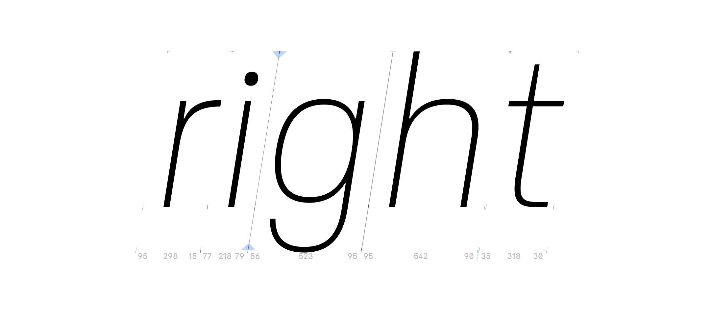

# RSB Line

A Glyphs.app plugin for showing an additional cursor at the right sidebearing (RSB). To use it, switch to the Text tool and choose *View > Show RSB* (de: *Nachbreite anzeigen*, fr: *Afficher approche droite*, es: *Mostrar lado derecho*).

### Installation

1. One-click install *RSB Line* from *Window > Plugin Manager*
2. Restart Glyphs.

### License

Copyright 2022 Fadhl Haqq (@akufadhl).
Based on sample code by Georg Seifert (@schriftgestalt) and Jan Gerner (@yanone).

Licensed under the Apache License, Version 2.0 (the "License");
you may not use this file except in compliance with the License.
You may obtain a copy of the License at

http://www.apache.org/licenses/LICENSE-2.0

See the License file included in this repository for further details.
